# Gate A finance training and presenter guide

**Audience:** presenter, Director, Area Manager and UAT reviewer. **Status:** source-backed synthetic demonstration, not a customer-data pilot. **Snapshot:** hosted finance-showcase generator version 8, seed 20260927, run cf17ee03-dfe7-59f6-8d18-faf51007d919. The screenshots in this guide were captured from the deployed app on 2026-09-25 UTC; the four images labelled **historical UAT** come from the prior 20260926 test run.

Start here for a spoken demonstration. Use [Gate A finance process flows](GATE_A_FINANCE_PROCESS_FLOWS.md) to train an operator on inputs, approvals, persistence and failure states. Use [Finance UAT](FINANCE_UAT.md) for state-changing test cases and [Gate A execution](GATE_A_EXECUTION.md) for what was actually verified. Generated controls in the active local expected-result manifest under fixtures/generated/hosted/PROJECT_REF/finance-showcase/expected.json supersede any amount printed here after the next reset. Generated manifests are intentionally not committed.

> Every casino, worker, contract, receipt and amount shown here is synthetic. Reference casino names do not assert a customer relationship. CleanOps is an operational finance layer; Sage/accounting remains the accounting source. A simulated WhatsApp candidate is not proof of a live Tornado group, and direct contribution is not net profit.

## 1. What the presenter must understand

| Term on screen | Meaning in this implementation | Presenter language |
| --- | --- | --- |
| Expected contract revenue | Projection from the currently effective Director-approved contract version and its billing rule. | “This is the contracted expectation, not an invoice or cash received.” |
| Recognized revenue | Accepted, approved, actual accounting import allocation for the selected period/site. | “This is the accepted accounting-side revenue used in the contribution view.” |
| Approved operational cost | A Director-posted expense or labour snapshot, or a separately recorded inventory/direct adjustment. | “A message, receipt, attendance record or request alone does not become cost.” |
| Matched cost | Link between an operational posting and an accepted accounting allocation. | “The link reconciles two sources; it does not create a second expense.” |
| Direct contribution | Recognized revenue minus accepted direct labour, supplies, repairs and other direct cost, when coverage and close are current. | “This excludes overhead, depreciation and tax.” |
| N/A or pending | Coverage, recognition, completeness or close is missing or stale. | “We leave the result unresolved rather than estimating it.” |

The current seed has four sites, 80 generated workers and 18 generated personas. Across its current contract revenue entries, expected revenue is CAD 31,853.00; approved expense cost is CAD 755.06; approved labour cost is CAD 789.00. These are **scenario-wide controls across generated dates**, not an August site contribution. In August, Grand Villa has CAD 1,851.92 recognized revenue, CAD 81.00 direct labour and CAD 1,770.92 direct contribution. River Rock has CAD 950.00 recognized revenue, CAD 73.09 supplies, CAD 95.24 repairs and CAD 781.67 direct contribution. The other two sites have no accepted August revenue; the combined all-site contribution therefore displays N/A.

## 2. Prepare a safe presentation

1. Confirm the active seed/run in the generated expected-result manifest and check [Gate A execution](GATE_A_EXECUTION.md) for the latest hosted state. If the scenario was reset, recapture or relabel screenshots before presenting.
2. Open the deployed [login page](https://cleanops-ai.vercel.app/login). Select **Darrel — Director · finance showcase**, not the legacy general-demo Director. Get the current password from the protected owner channel. Do not put it in a slide, recording, issue, chat log or browser URL.
3. Use a clean Director browser session for the finance route. Keep an Area Manager session separate for the access example. The synthetic banner must be visible.
4. For a **read-only customer demonstration**, follow §3. Do not create a new contract, receipt, time entry, import or period close. Those steps alter the hosted scenario and belong to the approved UAT/reset procedure in §4.
5. Open artifacts/tornado-demo/html-report/index.html or artifacts/tornado-demo/gate-a/recording-index.md if the protected local artifact folder is present. The repo contains the durable training screenshots below; raw videos/traces stay outside Git. [TORNADO_DEMO.md](../../TORNADO_DEMO.md) explains the artifact layout.

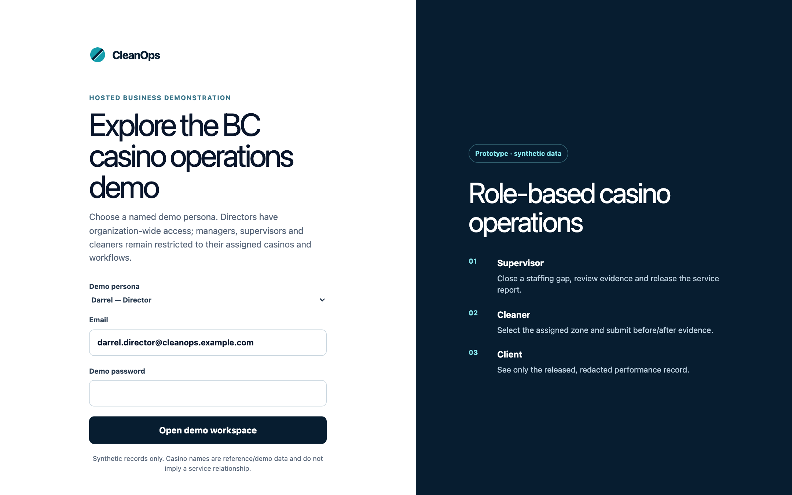

*Screen 00 — public login before credentials are entered. All following current-run screenshots use the protected finance-showcase organization.*

## 3. Read-only 10–12 minute manager demonstration

| Time | Click path | Show and say | Proof to point at |
| --- | --- | --- | --- |
| 0:00–1:00 | Login → Finance & inventory | State “prototype, synthetic data”; identify Director role and selected casino. | Banner and role in Screen 01. |
| 1:00–2:30 | Finance overview → August 2026 → Grand Villa | Separate expected from recognized revenue. Explain CAD 1,851.92 recognized less CAD 81.00 direct labour = CAD 1,770.92 direct contribution. | Screen 01 and approved-source panel, Screen 14. |
| 2:30–3:30 | Casino selector → River Rock | Show CAD 950.00 revenue less CAD 73.09 supplies and CAD 95.24 repairs = CAD 781.67. All assigned casinos returns N/A because not every site has accepted August accounting coverage. | Screen 02. |
| 3:30–5:00 | Contract register → DEMO-FINANCE-SHOWCASE | Open version 2 and synthetic amendment PDF. Point out October 1 future effect, weekday staffing, quarterly obligation and responsibility flags. The current page shows the latest amendment, not a complete on-screen version-history comparison. | Screens 03 and 10. |
| 5:00–6:15 | Finance Inbox → Expenses | Show retained source text, private receipt, reviewed claim, duplicate-hash warning and Director-only posting. Call the source a synthetic normalized WhatsApp/app candidate. | Screens 04 and 05. |
| 6:15–7:30 | Approved time and labour → Worker cost rates | Show 28.00 approved hours and two review exceptions at Grand Villa. Explain that a Director rate effective on the local work date is snapshotted only when approved time is posted. | Screens 06, 07 and 16. |
| 7:30–8:30 | One-off projects → HASTINGS-DEEP-CLEAN | Scroll past the incomplete follow-up. Show CAD 800.39 accounting recognized, CAD 157.30 direct cost, CAD 643.09 recognized contribution. The follow-up has pending contribution. | Screen 18. |
| 8:30–10:00 | Accounting reconciliation → August close controls | Show full accepted coverage, CAD 249.33 operational matched to CAD 249.33 accounting allocations, zero unmatched and zero unallocated. July is stale after change; June remains open with unresolved balances. | Screens 09 and 17. |
| 10:00–11:00 | Finance overview → source links | Use a review prompt or workspace link to return to its source. Explain that project subtotals are not added again to site totals. | Screens 01, 14 and 15. |
| 11:00–12:00 | Separate Area Manager session → finance and rates | Shayana sees assigned Grand Villa aggregates. A direct request to Worker cost rates displays confidential Director access required. Supervisor/Worker and Client finance denial was separately tested in hosted UAT. | Screens 11 and 13. |

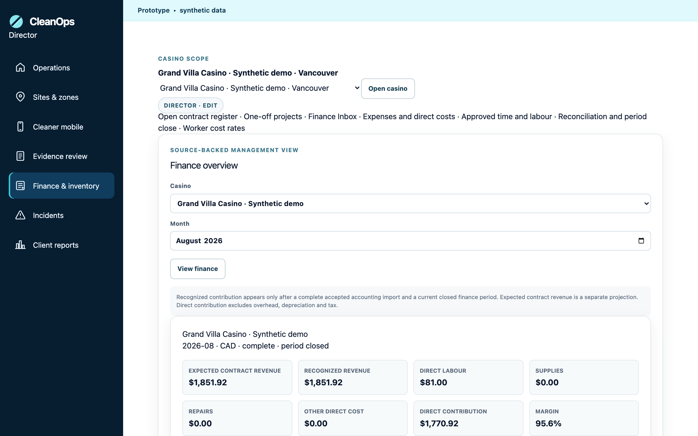

*Screen 01 — current-run Director overview. The August site card and its source status are the first accounting explanation.*

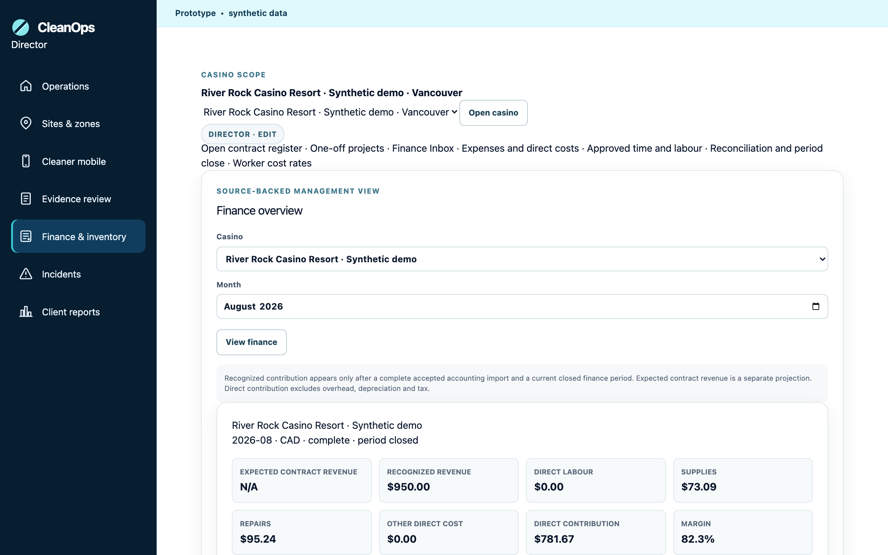

*Screen 02 — choose River Rock; compare the different direct-cost mix, not worker performance.*

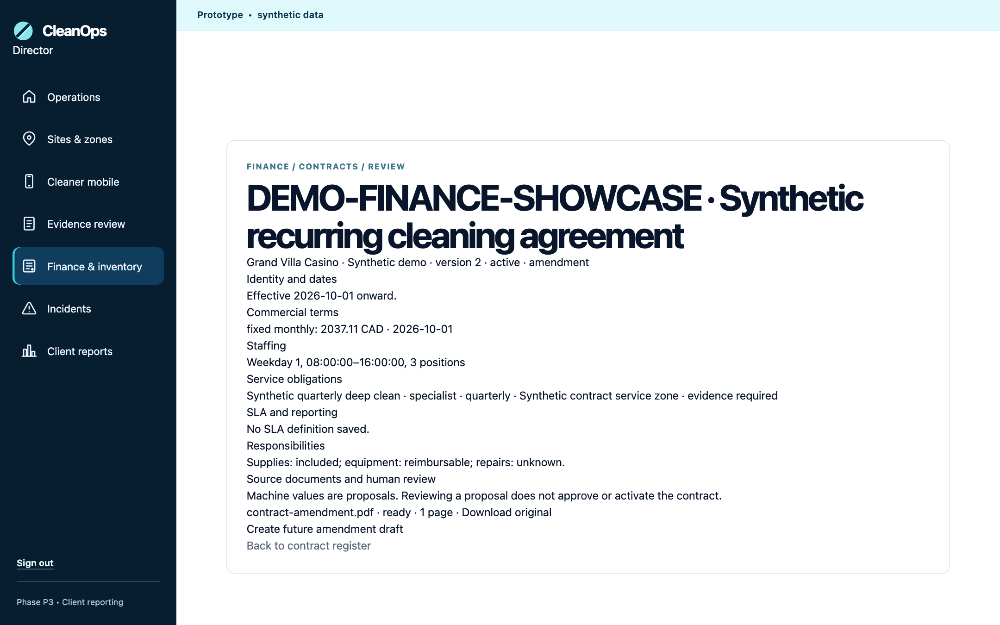

*Screen 10 — version 2 is active with a future October effective date. Read the current fixed amount from the page; do not reuse an earlier seed’s amount.*

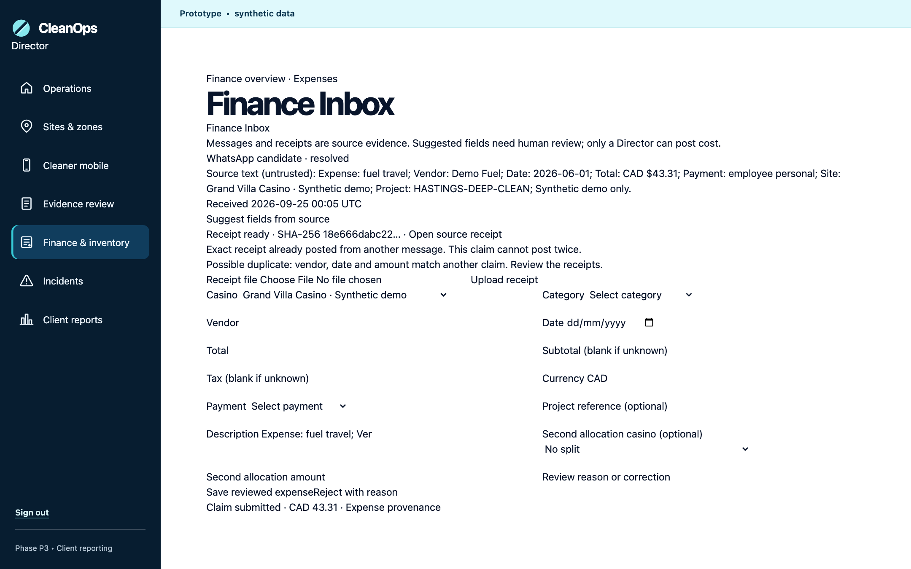

*Screen 04 — a candidate and its receipt are evidence. The exact receipt hash guard prevents a second posted cost.*

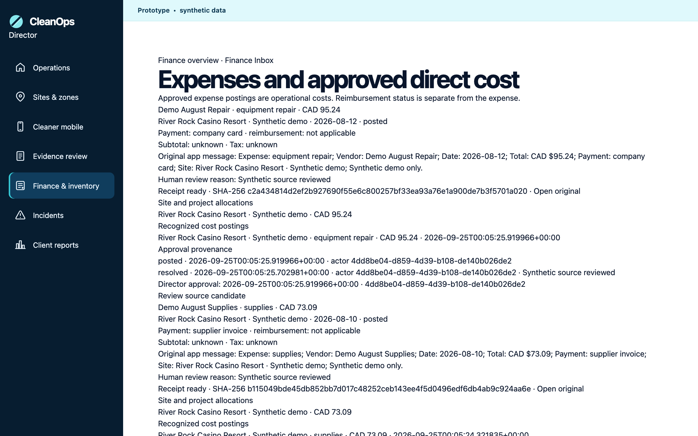

*Screen 05 — the posted supply/repair expense keeps original source, private receipt, review and site allocation.*

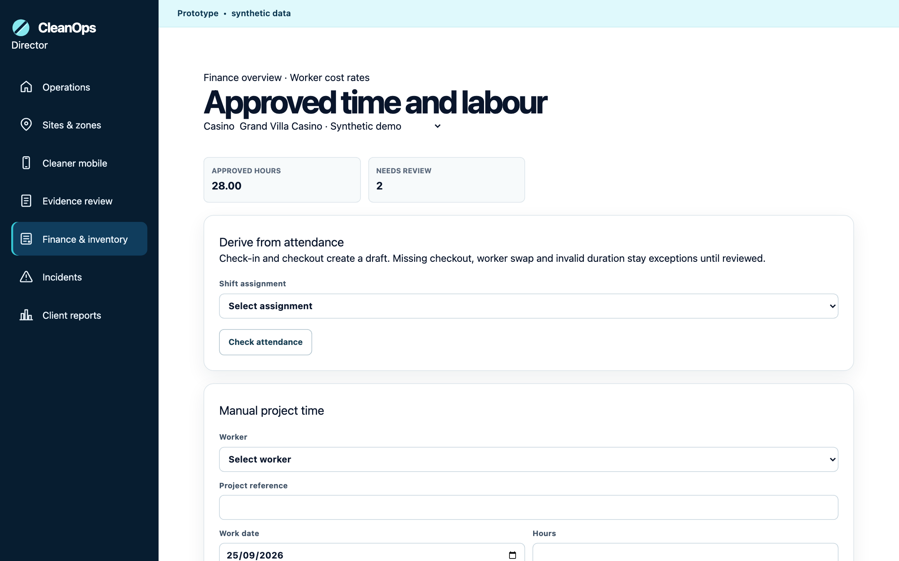

*Screen 06 — attendance-derived and manual project time share review and posting rules; an exception is not guessed into cost.*

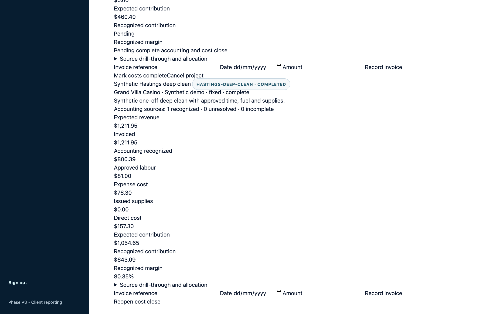

*Screen 18 — scroll to HASTINGS-DEEP-CLEAN. Its recognized contribution is source-backed; the earlier follow-up card remains pending.*

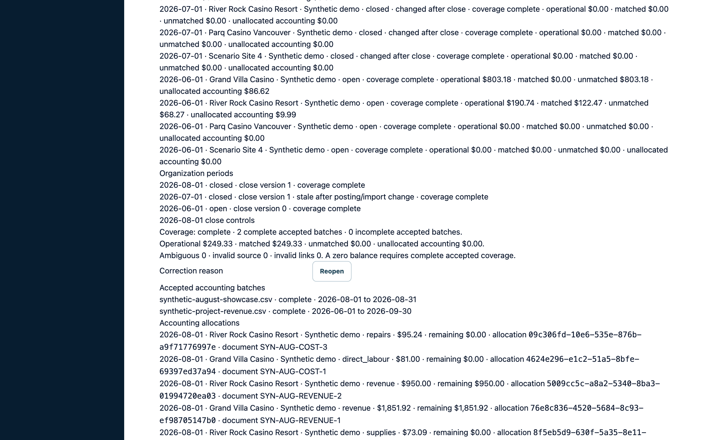

*Screen 17 — August is balanced and closed. A stale July close is a review signal even if its displayed unmatched amount is zero.*

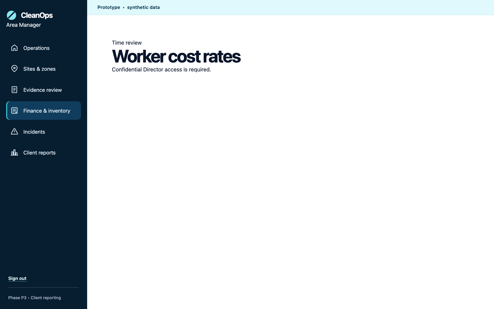

*Screen 13 — route denial is in addition to server-side role, site and database checks; a hidden menu item alone is not the access proof.*

## 4. Operator training: perform the state-changing flow only in an approved UAT window

Use the current local generated fixture descriptors (expense-receipts.json, contract-documents.json and time-cases.json in the protected hosted scenario pack) with [Finance UAT](FINANCE_UAT.md) for exact active inputs. The hosted run in the screenshots was reset **after** an earlier full UAT. Repeating writes now changes the current baseline and requires another exact-scope cleanup/reset. Record every new source ID, date, actor, before/after state and screenshot.

### A. Manual contract, PDF extraction and activation

1. As Director or assigned Area Manager, open **Contract register → Add contract**. Select a granted site and enter identity, dates, billing, staffing, obligations, SLA/reporting and responsibilities. Each wizard step persists a draft; reload it before moving on.
2. On a draft review page, stage the generated synthetic PDF. The browser uploads to private Storage using a scoped ticket; finalization checks actual bytes, type, size and hash. Run extraction and compare every proposed field with its cited source span.
3. Accept or edit supported terms; reject or mark unknown when the source is unclear. “Payment terms: TBD” remains unknown. A matched material proposal without a human decision blocks submission. If a submitted contract needs a correction, use **Return to draft** with a reason and resubmit.
4. The Director approves the priced version, checks **Activation impact preview**, then activates using its current token. The preview counts tasks, schedules, first 28 days of staffing coverage, SLA definitions and up to 12 fixed-fee periods. Reload and inspect generated records. A future amendment becomes a new version; it does not rewrite old task runs or prior expected revenue.

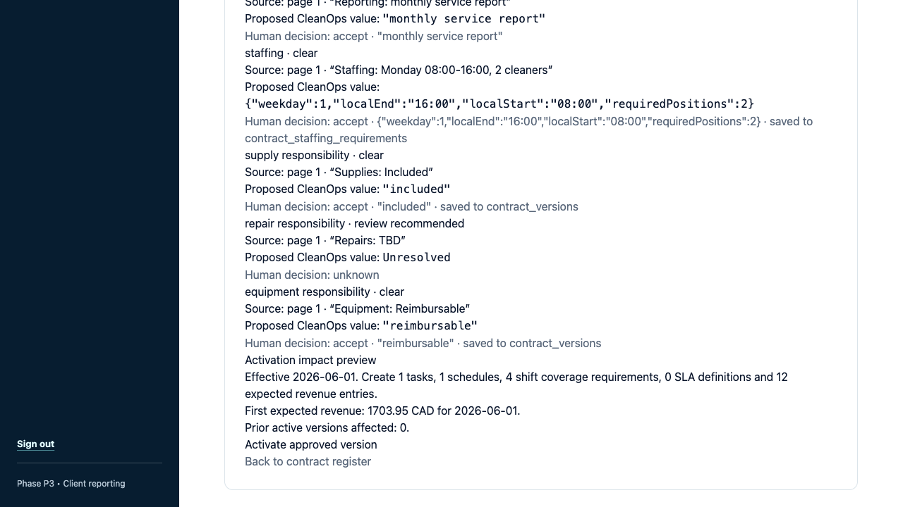

*Historical UAT — the tested preview created one task, one schedule, four coverage requirements and 12 expected revenue entries for that version. Its CAD 1,703.95 figure belongs to seed 20260926 and is not the active seed’s current contract amount.*

### B. App/normalized message, receipt, review and posting

1. An assigned user sends the generated sample text through **Submit an expense** or the supported simulator. The original message is stored first; the candidate has no cost effect.
2. Attach the synthetic receipt. A private upload ticket and server-side finalization verify file bytes and SHA-256. On **Finance Inbox**, the suggested vendor/date/amount/category is advisory. An empty field remains unknown.
3. Director or granted Area Manager resolves site, category, date, payment method, project/asset context and balanced allocations, or rejects with a reason. The Director alone approves a submitted claim; approval writes one immutable operational cost per allocation.
4. Send the same receipt bytes under a second message. The first source can remain; the second candidate must show the exact-hash warning and must not post again. Do not call this a live Tornado WhatsApp integration.

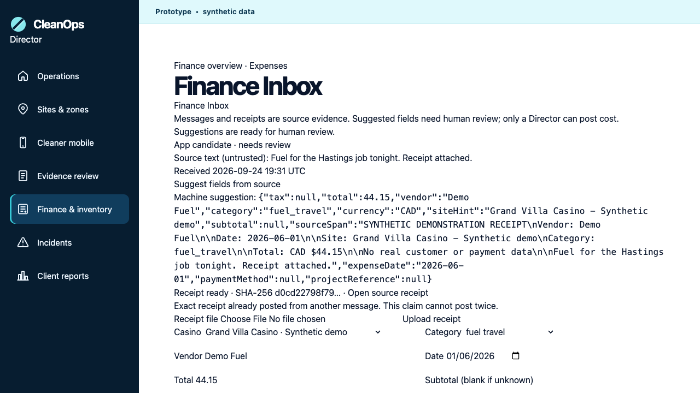

*Historical UAT — OCR suggested a synthetic fuel amount; payment method stayed unknown for human review. This image proves the tested app receipt path, not the current seed amount.*

### C. Time, rates, project and accounting close

1. On **Approved time and labour**, derive a shift entry from persisted attendance or create a manual project draft with a source reason. Missing checkout, swap and invalid duration remain exceptions. The operational reviewer approves actual hours and class. The Director maintains effective worker cost rates and posts approved time; posting writes a fixed labour-cost snapshot exactly once.
2. On **One-off projects**, an assigned manager creates a site-bound draft; a Director approves its commercial terms. Link approved time/expense/inventory/accounting sources without editing the original posting. An invoice is not accounting recognition. Mark costs complete only after review; incomplete accounting keeps recognized contribution pending.
3. On **Finance overview → Accounting CSV**, preview a supported synthetic file, review row mapping and accept the unchanged complete batch as Director. On **Accounting reconciliation**, run unique deterministic proposals or manually split/link amounts with a reason. Match only within the same period/site/project/category/currency and remaining balances.
4. Move the period to review and close only when accepted full-month coverage, source validity and all balances pass. A later import or posting marks a closed snapshot stale. Reopen with a reason, correct/void/link as needed, then close again.

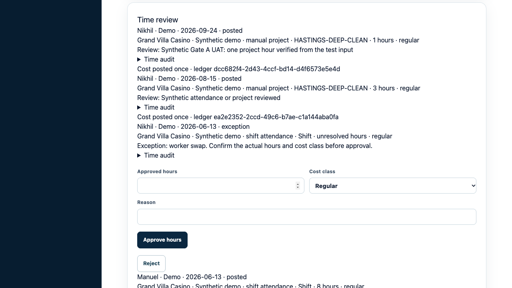

*Historical UAT — posted manual project time and a separate worker-swap exception remained distinguishable.*

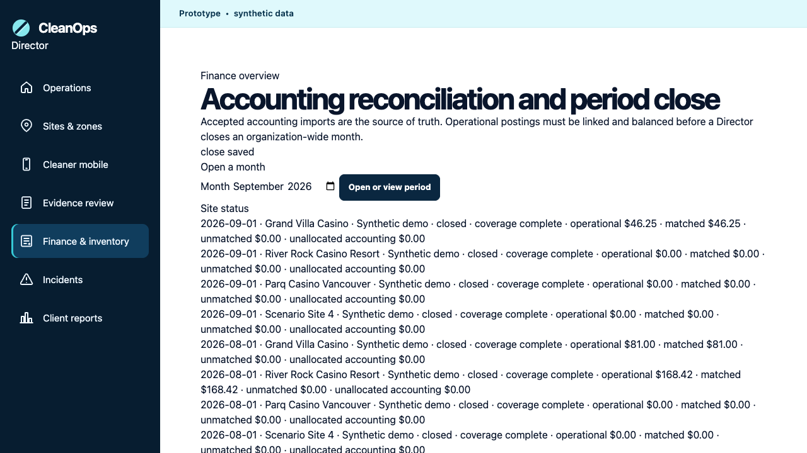

*Historical UAT — a corrected September batch was linked and closed. This is a recorded test transition, not the current run’s default September state.*

### D. Additional implemented Finance & inventory controls

Below the source-backed site summary, a Director can add an organization supplier and inventory item, record a site stock movement, and record a separately labelled direct labour adjustment. The database calculates ledger totals and audits later edits/deletes. Use the approved-time route for normal labour; the direct form is an administrative adjustment, not attendance-derived pay. The selected-site message context queue lets a Director or granted Area Manager confirm a source message's site, zone, task, worker and sender role without posting an expense. These controls are optional in the 10–12 minute finance presentation; [process flows §§12–13](GATE_A_FINANCE_PROCESS_FLOWS.md#12-supplier-catalogue-stock-ledger-and-administrative-adjustments) document their steps and boundary.

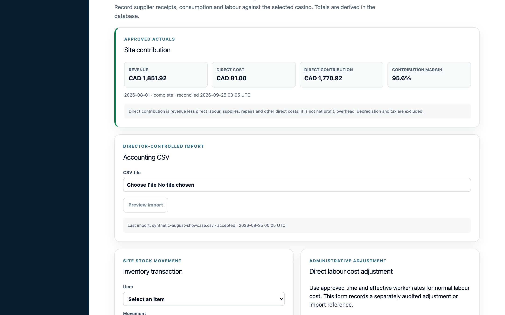

*Screen 15 — the accounting import is separate from site stock movement and an audited direct adjustment. None of these buttons alone proves a complete supply ordering or equipment repair workflow.*

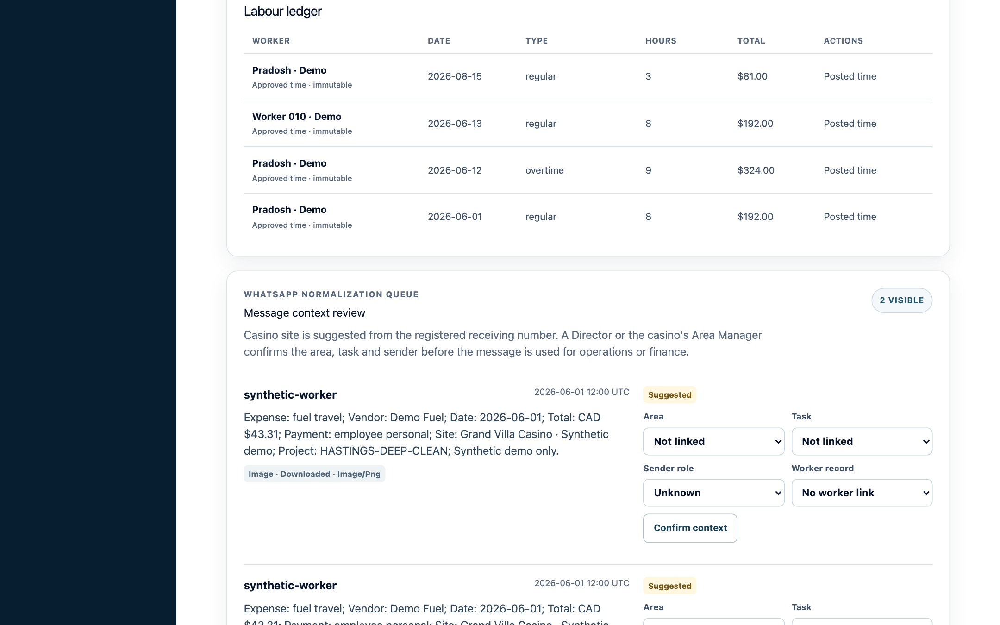

*Screen 19 — confirming operational context is distinct from reviewing and posting an expense. The source is a generated synthetic message.*

## 5. Role handoff and common questions

| Persona | What to show | What must stay inaccessible |
| --- | --- | --- |
| Finance Director | Organization-wide finance, commercial activation, cost rates, expense/time posting, accounting import/reconciliation/close. | No customer-data or live-channel claim. |
| Shayana Area Manager | Grand Villa only; draft/review operational context and see assigned-site aggregate finance. | River Rock, worker rates, confidential per-worker ledger, final financial posting/close. |
| Hardeep Supervisor / generated Worker | Assigned operational submissions/review through approved surfaces. | Finance dashboard and commercial/worker-rate data. |
| Finance Client viewer | Released client reporting only where a report exists. | Internal finance, contract files, private receipts and cost detail. |

**Why does the combined card say N/A?** The August result has two complete sites and two without accepted revenue coverage. The app does not turn partial coverage into a combined contribution.

**Why does the project show expected, invoiced and recognized separately?** A quote and invoice are operational/commercial records. Recognized revenue comes from accepted accounting allocations. Direct cost comes from approved operational sources. Complete accounting and Director cost close are required for final recognized contribution.

**Why is a receipt visible but not counted?** Submission, private-document readiness, machine suggestion, human resolution and Director posting are separate steps. Missing facts, invalid receipts or duplicate hashes block posting.

**Why is July stale after close?** Accepted imports or operational postings changed after the versioned close snapshot. A Director must review and explicitly reopen/reclose; the app does not silently rewrite history.

**Why can the Area Manager see a site amount but not a worker rate?** Aggregate finance is site scoped. The rates route and individual rate/ledger queries are Director-only, with server and database authorization.

**What is still outside Gate A evidence?** The owner deferred the physical iPhone Camera/Photo Library result. A human timed presenter rehearsal is still pending. The automated browser walkthrough passed, but it is not a human rehearsal. The Mock AI recorder chapter was skipped because its separate Restroom B evidence pair is absent. Official WhatsApp/Make, a live Sage feed and a customer-approved production pilot are separate gates.

## 6. Presenter finish checklist

- [ ] Confirm active seed/run, site/month and synthetic banner before speaking about amounts.
- [ ] Use the protected Director and separate Area Manager sessions; do not expose passwords.
- [ ] Read expected, recognized, approved operational, matched and pending as different states.
- [ ] Show at least one retained source and one human decision.
- [ ] Explain duplicate receipt and stale close as guards, not errors to hide.
- [ ] Keep the full UAT write sequence separate from the read-only customer demonstration.
- [ ] Record the remaining physical iPhone and human rehearsal outcomes before marking [Gate A #38](https://github.com/niru2015/cleanops-ai/issues/38) complete.

The [screenshot inventory](assets/gate-a-finance/README.md) records which images belong to the current run and which show historical UAT transitions.
